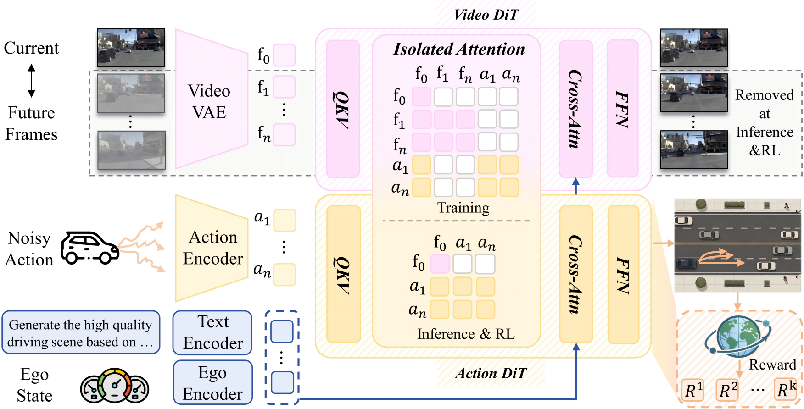
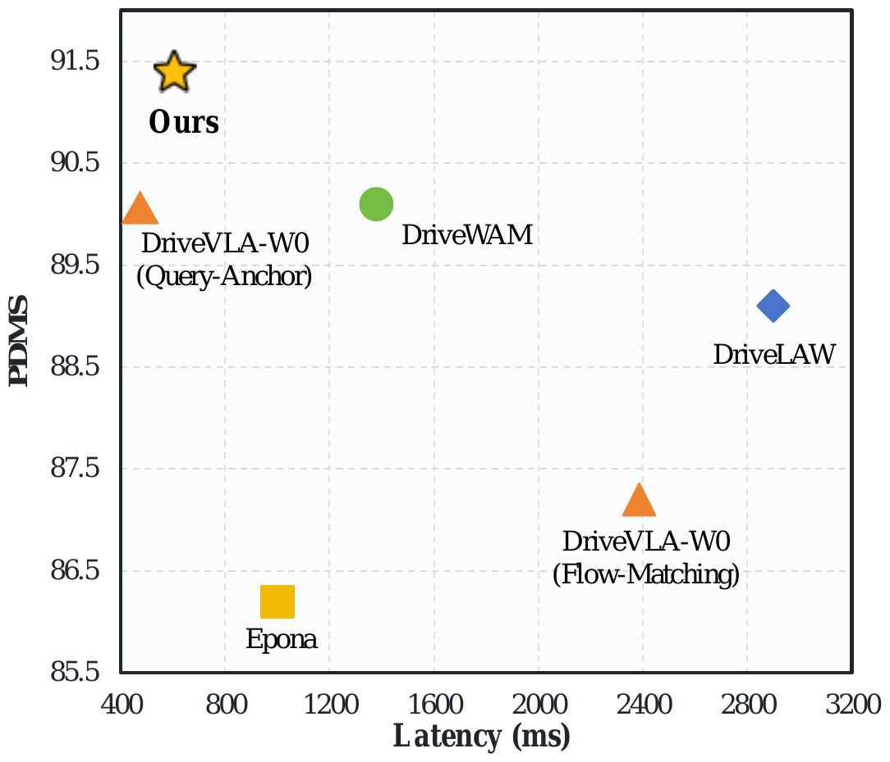
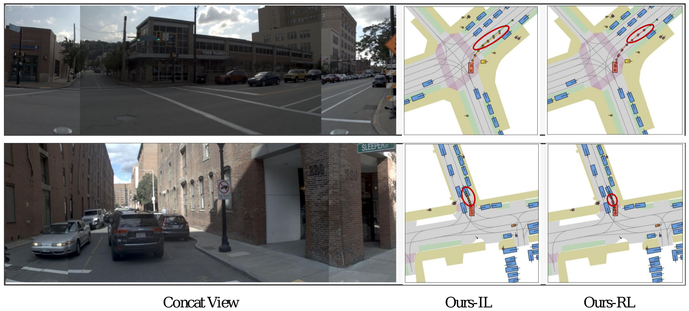

# SimWAM: A Simple World Action Model for End-to-End Autonomous Driving

KF P0 research extension: see [中文运行说明](README_KF.md) and [实施与验证记录](IMPLEMENTATION_NOTES_KF.md).


<div align="center">
  <a href="https://arxiv.org/abs/2608.07468"></a>
  <!-- <a href=""></a> -->
  <a href="https://github.com/H-EmbodVis/SimWAM"></a>
  <a href="https://huggingface.co/H-EmbodVis/SimWAM"></a>
  <a href="LICENSE"></a>

  <h4><em>Zongchuang Zhao<sup>1</sup>, Xin Zhou<sup>1</sup>, Tianyang Xu<sup>1</sup>, Zhengyang Sun<sup>1</sup>, Kaixuan Zhou<sup>2</sup>, Honglin Li<sup>2</sup>, <a href="https://dk-liang.github.io/">Dingkang Liang</a><sup>1&dagger;</sup>, <a href="https://scholar.google.com/citations?user=UeltiQ4AAAAJ&hl=en&oi=ao">Xiang Bai</a><sup>1</sup></em></h4>

  <sup>1</sup> Huazhong University of Science &amp; Technology<br>
  <sup>2</sup> Dongfeng Research &amp; Development Institute<br>
  <sup>&dagger;</sup> Project leader.
</div>

This repository provides the official implementation of **SimWAM** for the paper **A Simple World Action Model for End-to-End Autonomous Driving**, including supervised training and action-only reinforcement learning on NAVSIM.


---

## 📣 News

- `2026.08.19`: Released the SimWAM code and weight on the PhysicalAI-AV dataset.
- `2026.08.07`: Released the SimWAM [paper](https://arxiv.org/abs/2608.07468), code and [weight](https://huggingface.co/H-EmbodVis/SimWAM).

---

## 📄 Abstract

World-Action Models (WAMs) improve end-to-end autonomous driving by transferring video dynamics priors to action prediction, but existing methods incur costly test-time future imagination. We present **SimWAM**, a simple yet effective WAM that leverages future-video prediction as a training-time supervision signal. It co-trains a pretrained video expert and a lightweight action expert with joint flow matching. An isolated attention mask keeps action prediction independent of future frames, allowing trajectory prediction without explicit future-frame generation at inference. Since the two experts share no parameters and interact only through a unified attention interface, the video backbone could be replaced and the action expert scaled independently without modifying the learning objective or inference pipeline. We further apply reinforcement learning to optimize a compositional driving reward beyond trajectory imitation. Our SimWAM achieves 91.5 PDMS on NAVSIM, surpasses state-of-the-art WAM-based planners with substantially lower latency, and transfers zero-shot to nuScenes. These results position SimWAM as a simple yet solid baseline that could readily benefit from advances in video generation for efficient autonomous driving.

---

## 🔍 Overview

<div align="center">
  <a href="assets/architecture.png">
    
  </a>
  <br>
  <sub><b>Overview of SimWAM.</b> During training, the video and action DiTs are jointly optimized for future-frame generation and trajectory prediction via shared attention, while the isolated mask prevents the action tokens from accessing future-frame tokens. During inference and reinforcement learning, the model directly predicts trajectories without explicitly predicting future frames.</sub>
</div>

- **Joint flow-matching co-training.** The video expert &mdash; a video Diffusion Transformer initialized from Wan2.2-5B together with its video VAE and T5 text encoder &mdash; and a lightweight action DiT (hidden size 1024) are co-trained with joint flow matching over future-frame latents and trajectories. Future-video prediction serves as a training-time supervision signal that transfers a traffic-aware dynamics prior into the shared observation representation used for planning.
- **Isolated attention mask.** Future-frame tokens and action tokens both attend to the current observation latents while remaining mutually invisible, keeping action prediction independent of future frames. This mask is the only structural modification required to isolate the action tokens from future-frame information.
- **Direct trajectory prediction at inference.** Because the action expert never depends on future-frame tokens, explicit future-frame generation is omitted at deployment: the standalone action DiT directly predicts trajectories without auxiliary motion modules, substantially reducing inference latency.
- **Reinforcement learning.** The deterministic flow ODE is reformulated as a marginal-preserving SDE, and a group of candidate trajectories per scenario is optimized with FlowGRPO against the compositional NAVSIM PDM reward. RL focuses on the hard `navtrain` scenarios with the lowest PDMS after imitation learning and updates only the LoRA adapters of the action expert.
- **Flexibility.** The two experts share no weights and interact only through the unified attention interface: the video backbone is replaceable (e.g., LTX-Video, Wan2.1-1.3B, Cosmos2.5, Wan2.2-5B) and the action expert is independently scalable (0.21B&ndash;1.02B) without modifying the learning objective or inference pipeline.

---

## 📈 Performance

<div align="center">
  <a href="assets/pdms-latency.png">
    
  </a>
  <br>
  <sub><b>SimWAM achieves the best PDMS and the lowest inference latency among recent world-model-based planners on NAVSIM.</b></sub>
</div>

### NAVSIM `navtest`

Using only a single front camera at 384&times;672, SimWAM establishes a new state of the art on NAVSIM `navtest`, surpassing the strongest VLM-based planner SGDrive by 0.4 points and ExploreVLA, which explicitly incorporates future image prediction, by 1.1 points. It further outperforms the imagine-then-act WAMs DriveLaW and DriveWAM by 2.4 and 1.4 points, respectively.

| Method | Reference | Sensors | NC&uarr; | DAC&uarr; | EP&uarr; | TTC&uarr; | C&uarr; | PDMS&uarr; |
| --- | :---: | :---: | :---: | :---: | :---: | :---: | :---: | :---: |
| Human Agent | - | - | 100.0 | 100.0 | 87.5 | 100.0 | 99.9 | 94.8 |
| *Traditional E2E planners* | | | | | | | | |
| UniAD | CVPR'23 | 6&times;C | 97.8 | 91.9 | 78.8 | 92.9 | 100.0 | 83.4 |
| TransFuser | TPAMI'22 | 3&times;C+L | 97.7 | 92.8 | 79.2 | 92.8 | 100.0 | 84.0 |
| WorldRFT | AAAI'26 | 3&times;C | 97.8 | 96.8 | 81.7 | 94.0 | 100.0 | 87.8 |
| DiffusionDrive | CVPR'25 | 3&times;C+L | 98.2 | 96.2 | 82.2 | 94.7 | 100.0 | 88.1 |
| WoTE | ICCV'25 | 3&times;C+L | 98.5 | 96.8 | 81.9 | 94.9 | 99.9 | 88.3 |
| SeerDrive | NeurIPS'25 | 3&times;C+L | 98.4 | 97.0 | 83.2 | 94.9 | 99.9 | 88.9 |
| *VLM-based planners* | | | | | | | | |
| UniWorldVLA | arXiv'26 | 1&times;C | 98.7 | 96.7 | 83.2 | 96.1 | 100.0 | 89.4 |
| DriveDreamer-Policy | arXiv'26 | 3&times;C | 98.4 | 97.1 | 83.5 | 95.1 | 100.0 | 89.2 |
| AutoVLA | NeurIPS'25 | 3&times;C | 98.4 | 95.6 | 81.9 | **98.0** | 99.9 | 89.1 |
| ReCogDrive | ICLR'26 | 1&times;C | 97.9 | 97.3 | **87.3** | 94.9 | 100.0 | 90.8 |
| ExploreVLA | ECCV'26 | 1&times;C | 98.8 | 98.4 | 83.5 | 96.5 | 99.9 | 90.4 |
| DriveVLA-W0 | ICLR'26 | 1&times;C | 98.7 | **99.1** | 83.3 | 95.3 | 99.3 | 90.2 |
| SGDrive | CVPR'26 | 1&times;C | 98.6 | 97.8 | 85.8 | 96.2 | 100.0 | 91.1 |
| *World-model-based planners* | | | | | | | | |
| Epona | ICCV'25 | 1&times;C | 97.9 | 95.1 | 80.4 | 93.8 | 99.9 | 86.2 |
| PWM | NeurIPS'25 | 1&times;C | 98.6 | 95.9 | 81.8 | 95.4 | 100.0 | 88.1 |
| DriveLaW | CVPR'26 | 1&times;C | **99.0** | 97.1 | 81.3 | 96.7 | 100.0 | 89.1 |
| DriveWAM | arXiv'26 | 1&times;C | 98.3 | 98.1 | 84.3 | 95.2 | 100.0 | 90.1 |
| **SimWAM (Ours)** | - | 1&times;C | 98.4 | 98.7 | 86.4 | 95.5 | 100.0 | **91.5** |

### Component analysis

Video co-training and reinforcement learning contribute complementary gains, improving PDMS by 4.9 points while preserving the simplicity and efficient inference of the standalone action expert.

| Configuration | NC | DAC | EP | TTC | PDMS |
| --- | :---: | :---: | :---: | :---: | :---: |
| Action-only | 97.6 | 95.7 | 81.7 | 92.6 | 86.6 |
| + Video | **98.7** | 98.0 | 83.9 | **95.9** | 90.3 |
| + RL | 98.4 | **98.7** | **86.4** | 95.5 | **91.5** |

### Qualitative results

<div align="center">
  <a href="assets/qualitative.png">
    
  </a>
  <br>
  <sub><b>Qualitative comparison on two <code>navtest</code> scenarios.</b> After reinforcement learning, the ego commits further along the route while staying collision-free within the drivable area.</sub>
</div>

### NAVSIM v2 (`navtest`)

We further evaluate SimWAM on NAVSIM-v2, which adopts a reactive simulation
protocol and the unified EPDMS metric. In addition to the original PDMS terms,
EPDMS considers Driving Direction Compliance (DDC), Traffic Light Compliance
(TLC), Lane Keeping (LK), History Comfort (HC), and Extended Comfort (EC). All
NAVSIM-v2 experiments are conducted without reinforcement learning.

| Method | Reference | NC&uarr; | DAC&uarr; | DDC&uarr; | TLC&uarr; | EP&uarr; | TTC&uarr; | LK&uarr; | HC&uarr; | EC&uarr; | EPDMS&uarr; |
| --- | :---: | :---: | :---: | :---: | :---: | :---: | :---: | :---: | :---: | :---: | :---: |
| Human Agent | - | 100.0 | 100.0 | 99.8 | 100.0 | 87.4 | 100.0 | 100.0 | 98.1 | 90.1 | 90.3 |
| *Traditional E2E planners* | | | | | | | | | | | |
| TransFuser | TPAMI'22 | 96.9 | 89.9 | 97.8 | 99.7 | 87.1 | 95.4 | 92.7 | 98.3 | 87.2 | 76.7 |
| DiffusionDrive | CVPR'25 | 98.2 | 95.9 | 99.4 | 99.8 | 87.5 | 97.3 | 96.8 | 98.3 | **87.7** | 84.5 |
| *VLM-based planners* | | | | | | | | | | | |
| ReCogDrive* | ICLR'26 | 98.3 | 95.2 | 99.5 | 99.8 | 87.1 | 97.5 | 96.6 | 98.3 | 86.5 | 83.6 |
| SGDrive | CVPR'26 | 98.6 | 94.3 | 99.5 | **99.9** | 86.0 | 97.9 | 96.1 | 98.3 | 85.9 | 86.2 |
| DriveFine* | arXiv'26 | **98.7** | 97.3 | 99.5 | 99.8 | **88.7** | 97.8 | 97.7 | **98.4** | 83.8 | 89.7 |
| *World-model-based planners* | | | | | | | | | | | |
| DriveVLA-W0 | ICLR'26 | 98.5 | **99.1** | 98.0 | 99.7 | 86.4 | 98.1 | 93.2 | 97.9 | 58.9 | 86.1 |
| DriveLaW | CVPR'26 | **98.7** | 96.9 | 99.6 | 99.8 | 87.5 | 98.3 | 97.6 | **98.4** | 77.4 | 88.6 |
| **SimWAM (Ours)** | - | 98.6 | 98.0 | **99.7** | **99.9** | 87.5 | **98.4** | **97.9** | 98.3 | 84.4 | **90.2** |

\* indicates training with reinforcement learning.

### NAVSIM v2 (`navhard`)

`navhard` focuses on safety-critical scenarios and follows a two-stage
closed-loop protocol: stage 1 (S1) evaluates the planner on real-world
scenarios, while stage 2 (S2) re-evaluates the corresponding synthesized
scenarios with reactive traffic agents. Even before reinforcement learning,
SimWAM attains the best overall EPDMS of 37.6, surpassing DriveLaW by 7.0
points with leading DAC, DDC, TTC, and LK, especially in the reactive second
stage where surrounding agents respond to the ego vehicle.

| Method | Reference | Stage | NC&uarr; | DAC&uarr; | DDC&uarr; | TLC&uarr; | EP&uarr; | TTC&uarr; | LK&uarr; | HC&uarr; | EC&uarr; | EPDMS&uarr; |
| --- | :---: | :---: | :---: | :---: | :---: | :---: | :---: | :---: | :---: | :---: | :---: | :---: |
| *Traditional E2E planners* | | | | | | | | | | | | |
| TransFuser | TPAMI'22 | S1 | 96.2 | 79.5 | 99.1 | 99.5 | 84.1 | 95.1 | 94.2 | 97.5 | 79.1 | 23.1 |
| | | S2 | 77.7 | 70.2 | 84.2 | 98.0 | 85.1 | 75.6 | 45.4 | 95.7 | **75.9** | |
| DiffusionDrive | CVPR'25 | S1 | 96.8 | 86.0 | 98.8 | 99.3 | 84.0 | 95.8 | 96.7 | 97.6 | **79.6** | 27.5 |
| | | S2 | 80.1 | 72.8 | 84.4 | 98.4 | 85.9 | 76.6 | 46.4 | 96.3 | 72.8 | |
| *VLM-based planners* | | | | | | | | | | | | |
| SGDrive | CVPR'26 | S1 | 95.8 | 87.6 | 97.8 | **99.8** | 84.4 | 94.7 | 92.9 | **97.8** | 28.9 | 25.5 |
| | | S2 | 79.4 | 65.4 | 79.1 | **98.9** | 88.9 | 75.3 | 42.7 | 96.4 | 29.6 | |
| ReCogDrive | ICLR'26 | S1 | 96.4 | 78.9 | 98.7 | **99.8** | 82.6 | 95.6 | 94.4 | 97.6 | 74.2 | 25.7 |
| | | S2 | 80.2 | 65.0 | 82.4 | 98.7 | 85.2 | 76.9 | 43.8 | 96.6 | 71.8 | |
| DriveFine | arXiv'26 | S1 | 97.6 | 90.0 | 99.1 | 99.3 | **84.9** | 96.7 | **97.3** | 97.6 | 72.0 | 30.5 |
| | | S2 | 82.1 | 71.3 | 84.8 | 98.4 | 88.1 | 74.3 | 47.2 | **96.8** | 72.8 | |
| *World-model-based planners* | | | | | | | | | | | | |
| DriveVLA-W0 | ICLR'26 | S1 | 96.8 | 83.3 | 99.0 | 99.6 | 84.6 | 95.3 | 96.4 | 97.6 | 78.2 | 24.4 |
| | | S2 | 76.8 | 64.3 | 79.9 | 98.3 | **89.2** | 75.0 | 46.8 | 95.8 | 53.1 | |
| DriveLaW | CVPR'26 | S1 | 97.3 | 89.1 | 99.2 | 99.6 | 84.3 | **97.1** | 96.2 | **97.8** | 67.6 | 30.6 |
| | | S2 | **82.5** | 67.6 | 83.5 | 98.1 | 84.8 | 78.5 | 45.8 | 96.4 | 57.3 | |
| **SimWAM (Ours)** | - | S1 | **98.0** | **92.0** | **99.7** | 99.6 | 83.8 | 96.2 | **97.3** | **97.8** | 71.6 | **37.6** |
| | | S2 | 81.8 | **78.6** | **87.3** | 98.4 | 86.3 | **78.6** | **49.5** | 96.3 | 69.9 | |

### PhysicalAI-Autonomous-Vehicles

We evaluate on the same 1,000-clip test subset adopted by DriveWAM for a
consistent comparison, reporting Average Displacement Error (ADE) and Final
Displacement Error (FDE) over 3-second and 4-second future trajectories.
Although trained on only 65K samples, SimWAM achieves the best ADE and FDE at
both horizons. SV denotes single-view camera.

| Method | Source | Sensors | Params. | ADE@3s&darr; | FDE@3s&darr; | ADE@4s&darr; | FDE@4s&darr; |
| --- | :---: | :---: | :---: | :---: | :---: | :---: | :---: |
| VaVAM* | Valeo | SV | 1.3B | 2.31 | 4.32 | - | - |
| Alpamayo-1.5 | NVIDIA | SV | 10B | 0.80 | 2.31 | 1.44 | 4.18 |
| DriveWAM | - | SV | 5B + 8B | 0.47 | 1.35 | 0.83 | 2.47 |
| **SimWAM (Ours)** | - | SV | 6B | **0.40** | **1.08** | **0.69** | **1.96** |

\* evaluated using the released checkpoint, which only supports up to 3s prediction.

---

## ⚙️ Installation

Clone the repository:

```bash
git clone https://github.com/H-EmbodVis/SimWAM.git
cd SimWAM
```

Create a Python 3.10 environment and install the pinned runtime dependencies:

```bash
conda create -n simwam python=3.10 -y
conda activate simwam

python -m pip install -r requirements.txt
python -m pip install -e navsim --no-deps
python -m pip install -e navsim_v2 --no-deps
python -m pip install -e . --no-deps
```
For NAVSIM, nuPlan, maps, and dataset preparation, follow the
[official NAVSIM v1.1 repository](https://github.com/autonomousvision/navsim/tree/v1.1)
and the [nuPlan devkit](https://github.com/motional/nuplan-devkit). The required
release subset is included under `navsim/`.

All commands are intended to run from the repository root and use relative
paths by default.

---

## 📦 Preparation

### ActionDiT initialization

```bash
bash scripts/model_prepare.sh
```

### Text embeddings

```bash
bash scripts/precomput_text_embed.sh
```

Use `+overwrite=false` to keep existing embeddings.

---

## 🏋️ Training and Evaluation

### NAVSIM

#### Supervised training

```bash
NNODES=4 \
NPROC_PER_NODE=8 \
bash scripts/train_navsim_zero1_torchrun.sh \
  task=navsim_uncond_front_384x672_1e-4 \
  num_workers=8
```

#### FlowGRPO LoRA fine-tuning

```bash
NPROC_PER_NODE=8 \
bash scripts/train_navsim_grpo_zero1_torchrun.sh \
  task=navsim_grpo_action_pdm_384x672_flowgrpo_lora \
  num_workers=8 \
  model.checkpoint_path=./runs/navsim_uncond_front_384x672_1e-4/<run-id>/checkpoints/weights/step_XXXXXX.pt
```

Alternatively, set `SIMWAM_IL_CHECKPOINT` to the supervised checkpoint.

#### Evaluation

```bash
CKPT=./runs/navsim_grpo_action_pdm_384x672_flowgrpo_lora/<run-id>/checkpoints/weights/step_XXXXXX.pt \
TASK=navsim_grpo_action_pdm_384x672_flowgrpo_lora \
NPROC_PER_NODE=8 \
bash experiments/navsim/run_eval_navsim.sh
```

To verify the released supervised checkpoint with a one-sample smoke test:

```bash
CKPT=./weights/SimWAM.pt \
TASK=navsim_uncond_front_384x672_1e-4 \
NPROC_PER_NODE=1 \
bash experiments/navsim/run_eval_navsim.sh \
  EVALUATION.max_samples=1 \
  EVALUATION.num_inference_steps=2 \
  EVALUATION.save_videos=false
```


Training outputs are written to `runs/`; evaluation outputs are written to
`evaluate_results/navsim/`.

The supplied launchers use DeepSpeed ZeRO-1 through
`scripts/ds_configs/ds_zero1_config.json`. The matching Accelerate configuration
is `scripts/accelerate_configs/accelerate_zero1_ds.yaml`.

### NAVSIM v2 prediction and scoring

The v2 prediction scripts write token-level trajectories for `navtest` or
`navhard_two_stage`; the scoring launcher consumes those `.npy` files with the
v2 PDM evaluator. Set `CKPT`, `EXP_NAME`, and the dataset/cache roots as needed.

```bash
CKPT=./weights/SimWAM.pt EXP_NAME=simwam_v2 \
  bash experiments/navsim/run_predict_navsim_v2.sh

CKPT=./weights/SimWAM.pt EXP_NAME=simwam_navhard \
  bash experiments/navsim/run_predict_navhard.sh

EXP_NAME=simwam_v2 SPLIT=both \
  bash navsim_v2/scripts/evaluation/run_npy_trajectory_agent_pdm_score_evaluation.sh
```

### PhysicalAI

The PhysicalAI data is built from the
[NVIDIA PhysicalAI-Autonomous-Vehicles dataset](https://huggingface.co/datasets/nvidia/PhysicalAI-Autonomous-Vehicles).
The training/test clip splits and data processing follow
[DriveWAM](https://github.com/chenshi3/DriveWAM)
([Hugging Face](https://huggingface.co/chenchenshi/DriveWAM)).

The migrated metadata files are `data/physicalai_train.jsonl` and
`data/physicalai_dataset_stats.json`. Keep the referenced front-camera frames
under `data/physicalai/images/` using the relative paths in the JSONL file.

The PhysicalAI checkpoint and training data are available on our
[Hugging Face repository](https://huggingface.co/H-EmbodVis/SimWAM).

Train and evaluate with:

```bash
NPROC_PER_NODE=2 bash scripts/train_physicalai_zero1_torchrun.sh \
  task=physicalai_uncond_front_384x672_1e-4

CKPT=./weights/SimWAM-PAI-AV.pt NPROC_PER_NODE=1 \
  bash experiments/physicalai/run_eval.sh \
  EVALUATION.max_clips=1 EVALUATION.num_inference_steps=2
```

---

## 👍 Acknowledgement

SimWAM builds upon the following projects and resources:

- [NAVSIM](https://github.com/autonomousvision/navsim) for the planning benchmark and evaluation tooling.
- [nuPlan / OpenScene](https://github.com/motional/nuplan-devkit) for the driving datasets.
- [Wan2.2](https://github.com/Wan-Video/Wan2.2) for the pretrained video generation backbone.
- [NVIDIA PhysicalAI-Autonomous-Vehicles](https://huggingface.co/datasets/nvidia/PhysicalAI-Autonomous-Vehicles) for the PhysicalAI driving dataset.
- [DriveWAM](https://github.com/chenshi3/DriveWAM) for the PhysicalAI clip splits and data processing.

---

## 📖 Citation

If SimWAM is useful in your research, please consider citing the paper:

```bibtex
@article{zhao2026simwam,
  title={SimWAM: A Simple World Action Model for End-to-End Autonomous Driving}, 
  author={Zongchuang Zhao and Xin Zhou and Tianyang Xu and Zhengyang Sun and Kaixuan Zhou and Honglin Li and Dingkang Liang and Xiang Bai},
  journal={arXiv preprint arXiv:2608.07468},
  year = {2026}
}
```

---

## License

See [LICENSE](LICENSE). NAVSIM, Wan2.2, nuPlan, and OpenScene retain their own
licenses and distribution terms. Refer to the official
[NAVSIM license](https://github.com/autonomousvision/navsim/blob/v1.1/LICENSE),
[Wan2.2 repository](https://github.com/Wan-Video/Wan2.2), and
[nuPlan license](https://github.com/motional/nuplan-devkit/blob/master/LICENSE.txt)
for upstream terms.
